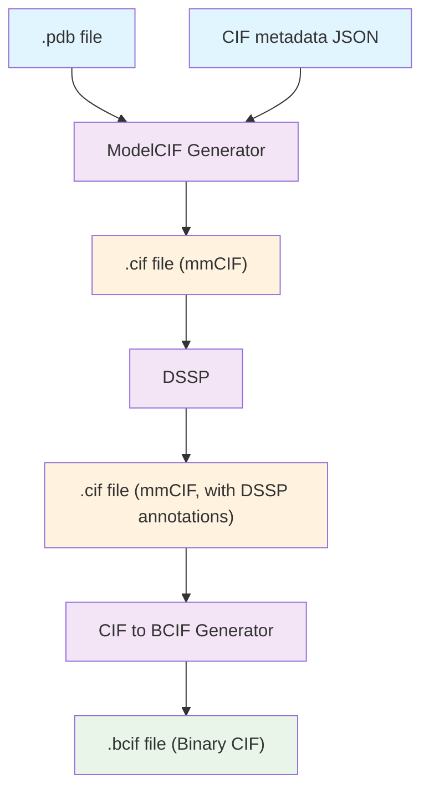

# AFDB Integration Toolkit

A comprehensive toolkit for integrating structural models into the AlphaFold Database (AFDB). This toolkit provides essential tools and workflows to prepare, validate, and format molecular structure data for seamless integration with AFDB infrastructure.

## Table of Contents

- [AFDB Integration Toolkit](#afdb-integration-toolkit)
  - [Table of Contents](#table-of-contents)
  - [Features](#features)
  - [Prerequisites](#prerequisites)
  - [Installation](#installation)
    - [1. Clone the Repository](#1-clone-the-repository)
    - [2. Install UV (Python Package Manager)](#2-install-uv-python-package-manager)
    - [3. Install Mol\* CLI](#3-install-mol-cli)
    - [4. Install DSSP](#4-install-dssp)
    - [5. Download mmCIF Dictionary (Required for ModelCIF Generator)](#5-download-mmcif-dictionary-required-for-modelcif-generator)
    - [6. Install Nextflow (Optional)](#6-install-nextflow-optional)
    - [7. Install Docker (Optional)](#7-install-docker-optional)
  - [Quick Start](#quick-start)
    - [Verify Installation](#verify-installation)
    - [Basic Usage Example](#basic-usage-example)
  - [Usage](#usage)
    - [ModelCIF Generator](#modelcif-generator)
    - [CIF to BCIF Converter](#cif-to-bcif-converter)
    - [DSSP Secondary Structure Assignment](#dssp-secondary-structure-assignment)
    - [Metadata Schema Validation](#metadata-schema-validation)
  - [Docker Usage](#docker-usage)
    - [Use Prebuilt Docker Image (Recommended)](#use-prebuilt-docker-image-recommended)
    - [Build Docker Image (Optional)](#build-docker-image-optional)
    - [Build Docker Image](#build-docker-image)
    - [Run Tools in Docker](#run-tools-in-docker)
  - [Nextflow Workflow](#nextflow-workflow)
    - [End-to-End Processing](#end-to-end-processing)
    - [Workflow Structure](#workflow-structure)
    - [Schema Validation](#schema-validation)
    - [Input Requirements](#input-requirements)
    - [Workflow Features](#workflow-features)
    - [Important Notes](#important-notes)
  - [File Structure Requirements](#file-structure-requirements)
    - [Input Directory Structure](#input-directory-structure)
    - [Directory Structure Rules](#directory-structure-rules)
    - [Output Structure](#output-structure)
  - [Troubleshooting](#troubleshooting)
    - [Common Issues](#common-issues)
    - [Getting Help](#getting-help)
  - [License](#license)
  - [Support](#support)

## Features

- **ModelCIF Generation**: Convert PDB files to mmCIF format with metadata integration
- **Binary CIF Conversion**: Efficient conversion from mmCIF to Binary CIF (BCIF) format
- **Secondary Structure Assignment**: DSSP-based secondary structure annotation
- **Metadata Schema Validation**: Validate model and provider metadata JSONs against AFDB-defined schemas
- **UniProt Metadata Tooling**: Streamline UniProt subset extraction and AF metadata generation (see [uniprot/README.md](uniprot/README.md))
- **Automated Workflows**: Nextflow-based end-to-end processing pipelines
- **Docker Support**: Containerized execution for reproducible results
- **Validation Tools**: Built-in testing and validation utilities


## Prerequisites

- Python 3.12+
- Node.js 18+ (for Mol* CLI)
- Docker (optional, for containerized execution)
- Nextflow (optional, for workflow automation)

## Installation

### 1. Clone the Repository

```bash
git clone https://github.com/PDBeurope/AFDB-Integration-Kit
cd AFDB-Integration-Kit
```

### 2. Install UV (Python Package Manager)

UV is used to manage Python dependencies and virtual environments.

**macOS/Linux:**
```bash
curl -LsSf https://astral.sh/uv/install.sh | sh
```

**Windows:**
```bash
powershell -c "irm https://astral.sh/uv/install.ps1 | iex"
```

**Alternative installation methods:**
```bash
# Using pip
pip install uv

# Using conda
conda install -c conda-forge uv
```

### 3. Install Mol* CLI

If you use nvm (Node Version Manager):
```bash
nvm use  # Uses the version specified in .nvmrc
npm install -g molstar
```

Without nvm:
```bash
npm install -g molstar
```

### 4. Install DSSP

We use the modern DSSP implementation by the PDB-REDO team:

```bash
# Clone and build DSSP
git clone https://github.com/PDB-REDO/dssp.git
cd dssp
mkdir build
cd build
cmake ..
make
sudo make install
```

For detailed installation instructions, visit: https://github.com/PDB-REDO/dssp

### 5. Download mmCIF Dictionary (Optional)

The ModelCIF tool has an additional option to validate the mmCIF files against the updated model cif dictionary. 
This is an optional parameter, but it is recommended to validate the output files when first setting up the tool.

Download the modelcif dictionary to your project directory:

```bash
# Download the mmCIF dictionary
curl -o mmcif_ma.dic https://raw.githubusercontent.com/ihmwg/ModelCIF/refs/heads/master/dist/mmcif_ma.dic
```

**Note:** This step is automatically handled in the Docker environment, but is required for local installations.

### 6. Install Nextflow (Optional)

For workflow automation:

```bash
# Using curl
curl -s https://get.nextflow.io | bash

# Make executable and add to PATH
chmod +x nextflow
sudo mv nextflow /usr/local/bin/
```

### 7. Install Docker (Optional)

For containerized execution:
- **macOS/Windows**: Download Docker Desktop from https://www.docker.com/products/docker-desktop
- **Linux**: Follow instructions at https://docs.docker.com/engine/install/

## Quick Start

### Verify Installation

Test that all dependencies are correctly installed:

```bash
uv run main.py test
```

This command will validate your environment and report any missing dependencies.

### Basic Usage Example

```bash
# Generate ModelCIF
uv run main.py run-modelcif-gen \
    -p input/AF-0000000000000001-model-v1.pdb \
    -m input/AF-0000000000000001-v1.cif.json \
    -o output/AF-0000000000000001-model-v1.cif

# Convert to BCIF
uv run main.py run-cif2bcif \
    -i input/AF-0000000000000001-model-v1.cif \
    -o output/AF-0000000000000001-model-v1.bcif

# Add secondary structure annotation
uv run main.py run-dssp \
    -i input/AF-0000000000000001-model-v1.cif \
    -o output/AF-0000000000000001-model-v1.cif
```

## Usage

### ModelCIF Generator

Converts PDB files to mmCIF format with integrated metadata.

**Requirements:**
- Input PDB file
- Metadata JSON file conforming to the schema: `afdb_integration_kit/modelcif/resources/schema.json`
- Optional: ModelCIF dictionary (`mmcif_ma.dic`) if you intend to run `--validate`

**Optional validation dictionary:** Only needed when you pass `--validate` (or `--validate ""`, which defaults to `mmcif_ma.dic`). Download it once and keep it in the project directory:
```bash
curl -o mmcif_ma.dic https://raw.githubusercontent.com/ihmwg/ModelCIF/refs/heads/master/dist/mmcif_ma.dic
```

**Command:**
```bash
uv run main.py run-modelcif-gen -p <pdb_file> -m <metadata_json> -o <output_cif>
```

**Parameters:**
- `-p, --pdb`: Input PDB file path
- `-m, --metadata`: Metadata JSON file path
- `-o, --output`: Output mmCIF file path

### ModelPDB Generator

Adds AFDB-specific header information from the generated mmCIF back into the PDB file (so downstream consumers get consistent metadata in both formats).

**Requirements:**
- Input mmCIF file (from `run-modelcif-gen`)
- Input PDB file containing ATOM coordinates
- Provider metadata JSON file (`provider.json`) describing who generated the entry

**Command:**
```bash
uv run main.py run-modelpdb-gen \
    -c <input_cif> \
    -p <input_pdb> \
    -r <provider_json> \
    -o <output_pdb>
```

**Parameters:**
- `-c, --cif`: Input mmCIF file path
- `-p, --pdb`: Input PDB file path
- `-r, --provider`: Provider metadata JSON path
- `-o, --output`: Output PDB file path with enriched headers

### CIF to BCIF Converter

Converts mmCIF files to Binary CIF format for efficient storage and transmission.

**Command:**
```bash
uv run main.py run-cif2bcif -i <input_cif> -o <output_bcif>
```

**Parameters:**
- `-i, --input`: Input mmCIF file path
- `-o, --output`: Output BCIF file path

### DSSP Secondary Structure Assignment

Assigns secondary structure annotations based on atomic coordinates.

**Command:**
```bash
uv run main.py run-dssp -i <input_cif> -o <output_cif>
```

**Parameters:**
- `-i, --input`: Input mmCIF file path
- `-o, --output`: Output annotated mmCIF file path

### Validation Toolkit

Use these commands to sanity-check individual artifacts or entire datasets before handing results to collaborators.

#### Schema Validation

Validate metadata JSON files (`model` or `provider`) against the required JSON schemas to ensure data consistency and compliance.

**Schemas:**

* Model: `afdb_integration_kit/metadata/resources/model_schema.json`
* Provider: `afdb_integration_kit/metadata/resources/provider_schema.json`

**Command:**

```bash
uv run main.py run-schema-validation -i <metadata_json_file> -t <type>
```

**Parameters:**

* `-i, --input`: Path to the metadata JSON file to validate
* `-t, --type`: Type of metadata to validate (`model` or `provider`)

**Examples:**

```bash
uv run main.py run-schema-validation -i model.json -t model
uv run main.py run-schema-validation -i provider.json -t provider
```

#### Dataset-Level Validators

Run multiple checks across an input directory (the same layout expected by the workflow):

```bash
# Run all enabled validators using defaults.yaml
uv run main.py run-validations --root input/

# Run a subset with custom config and JSON output
uv run main.py run-validations \
    --root input/ \
    --checks naming plddt pae \
    --config my-validations.yaml \
    --out reports/validation.json
```

- `run-validations` respects `validation/defaults.yaml` but you can override settings via `--config`.
- Use `--summary`, `--errors-only`, and `--fail-on warn` to tailor CLI output/exit codes.
- `run-naming-check` provides a lightweight naming/required-file audit with simplified flags:

```bash
uv run main.py run-naming-check --root input/ --errors-only
```

- `plddt-check` focuses on pLDDT JSONs (value ranges, counts, optional structure cross-checks):

```bash
uv run main.py plddt-check --root input/ --verbose
```

#### Single-File Validators

Ideal for workflow steps (e.g., Nextflow processes) that emit one artifact at a time:

```bash
# Metadata (batch or per-accession JSON)
uv run main.py validate-metadata-file --file path/to/metadata.json

# pLDDT confidence JSON
uv run main.py validate-plddt-file --file path/to/AF-...-confidence_v1.json

# PAE JSON
uv run main.py validate-pae-file --file path/to/AF-...-predicted_aligned_error_v1.json

# Check a matching pLDDT/PAE pair
uv run main.py validate-relationships-pair \
    --plddt-file path/to/AF-...-confidence_v1.json \
    --pae-file path/to/AF-...-predicted_aligned_error_v1.json

# FASTA sequences file
uv run main.py validate-sequences-file --file path/to/sequences.fasta
```

Each command exits with code `1` if it encounters validation errors, making them easy to embed in automated pipelines.

## Docker Usage

### Use Prebuilt Docker Image (Recommended)

You can skip building the image locally by using the prebuilt image available on Docker Hub:

```bash
docker pull pdbegroup/afdb-integration-toolkit
```

Use it in the same way as the locally built image. For example:

```bash
docker run \
    -v "$PWD/input:/input" \
    -v "$PWD/output:/output" \
    -w /workspace \
    -v "$PWD:/workspace" \
    pdbegroup/afdb-integration-toolkit uv run main.py run-modelcif-gen \
        -p /input/AF-0000000000000001-model-v1.pdb \
        -m /input/AF-0000000000000001-v1.cif.json \
        -o /output/AF-0000000000000001-model-v1.cif
```

### Build Docker Image (Optional)

If you prefer to build the image yourself:

```bash
docker build -t afdb-toolkit .
```


### Build Docker Image

```bash
docker build -t afdb-toolkit .
```

### Run Tools in Docker

**ModelCIF Generator:**
```bash
docker run \
    -v "$PWD/input:/input" \
    -v "$PWD/output:/output" \
    -w /workspace \
    -v "$PWD:/workspace" \
    afdb-toolkit uv run main.py run-modelcif-gen \
        -p /input/AF-0000000000000001-model-v1.pdb \
        -m /input/AF-0000000000000001-v1.cif.json \
        -o /output/AF-0000000000000001-model-v1.cif
```

**CIF to BCIF Converter:**
```bash
docker run \
    -v "$PWD/input:/input" \
    -v "$PWD/output:/output" \
    -w /workspace \
    -v "$PWD:/workspace" \
    afdb-toolkit uv run main.py run-cif2bcif \
        -i /input/AF-0000000000000001-model-v1.cif \
        -o /output/AF-0000000000000001-model-v1.bcif
```

**DSSP Processing:**
```bash
docker run \
    -v "$PWD/input:/input" \
    -v "$PWD/output:/output" \
    -w /workspace \
    -v "$PWD:/workspace" \
    afdb-toolkit uv run main.py run-dssp \
        -i /input/AF-0000000000000001-model-v1.cif \
        -o /output/AF-0000000000000001-model-v1.cif
```

**Schema Validation**

Run schema validation in Docker:

```bash
docker run \
    -v "$PWD/input:/input" \
    -v "$PWD/output:/output" \
    -w /workspace \
    -v "$PWD:/workspace" \
    afdb-toolkit uv run main.py run-schema-validation -i model.json -t model
```

Replace `model.json` with the actual path to your metadata file. For provider metadata:

```bash
afdb-toolkit uv run main.py run-schema-validation -i provider.json -t provider
```

## Nextflow Workflow

The nextflow scripts are placed in the `workflow` directory. The main workflow script is `workflow.nf`, which orchestrates the end-to-end processing of the model files (except metadata JSON validation). `validate.nf` is used for schema validation of model and provider metadata files.

### End-to-End Processing

Run the complete workflow using the provided script:

```bash
docker run \
    -v "$PWD/nf_workspace/.nextflow:/workspace/.nextflow" \
    -v "$PWD/output:/output" \
    -v "$PWD/input:/input" \
    -w /workspace \
    -v "$PWD/nf_workspace:/workspace" \
    afdb-toolkit nextflow run /app/workflow/workflow.nf -resume
```

This will process all the model files in the `input` directory and place the output files in the `output` directory.


### Workflow Structure



### Schema Validation
Run the schema validation workflow using the provided script. This workflow performs two tasks:

1. **Validate Metadata**: Ensures that the model metadata JSON files conform to the required schema.
2. **Batch Processing**: If validation is successful, the workflow concatenates the JSON files into a list of JSONs for further processing based on a configurable chunk size, which defaults to 100.

To adjust the chunk size, update the `params.metadata_chunk_size` parameter in the `workflow/validate.nf` script or pass it as a command-line argument when executing the workflow. For example:

```bash
--metadata_chunk_size 100
```

```bash
docker run \
    -v "$PWD/nf_workspace/.nextflow:/workspace/.nextflow" \
    -v "$PWD/input:/input" \
    -v "$PWD/output:/output" \
    -w /workspace \
    -v "$PWD/nf_workspace:/workspace" \
    afdb-toolkit nextflow run /app/workflow/validate.nf -resume
```

The output will be stored in the `output/metadata` directory, containing the batched validated model metadata JSON files.

### Input Requirements

The Nextflow workflow requires an input list file at `input/input.txt` containing the entries to process. Each entry should be on a new line:

```
AF-0001234567890123
AF-0001234567890124
AF-0001234567890125
AF-0001234567890126
```

**Example input.txt:**
```bash
# Create the input list file
cat > input/input.txt << EOF
AF-0001234567890123
AF-0001234567890124
AF-0001234567890125
EOF
```

### Workflow Features

- **Resumable**: Uses `-resume` flag to continue from previous checkpoints
- **Cached**: Maintains state in `.nextflow` directory
- **Dependency Management**: Automatically handles tool dependencies
- **Parallel Processing**: Processes multiple files concurrently

### Important Notes

- Mount the `.nextflow` directory to preserve workflow state
- Ensure proper input/output directory mounting
- The workflow runs in resume mode by default

## File Structure Requirements

### Input Directory Structure

The toolkit expects files to be organized in a specific hierarchical structure:

```
input/
├── 0001/
│   ├── 2345/
│   │   ├── 6789/
│   │   │   ├── 0123/
│   │   │   │   ├── AF-0001234567890123-model-v1.pdb
│   │   │   │   └── AF-0001234567890123-v1.cif.json
```

### Directory Structure Rules

1. **Extract 16-digit numeric ID**: From `AF-0001234567890123-model-v1.pdb` → `0001234567890123`
2. **Split into 4-digit segments**: `0001`, `2345`, `6789`, `0123`
3. **Create nested directories**: `0001/2345/6789/0123/`
4. **Place files in final directory**: Both PDB and JSON files

### Output Structure

The workflow automatically creates corresponding output directories following the same structure:

```
output/
├── 0001/
│   ├── 2345/
│   │   ├── 6789/
│   │   │   ├── 0123/
│   │   │   │   ├── AF-0001234567890123-model-v1.cif
│   │   │   │   └── AF-0001234567890123-model-v1.bcif
```

## Troubleshooting

### Common Issues

1. **Missing Dependencies**: Run `uv run main.py test` to identify missing components
2. **Permission Errors**: Ensure Docker has proper access to mounted directories
3. **File Not Found**: Verify input files follow the required directory structure
4. **Memory Issues**: For large datasets, consider adjusting Docker memory limits
5. **ModelCIF Validation Errors**: Ensure `mmcif_ma.dic` is present in the project directory (automatically handled in Docker)
6. **Nextflow Workflow Errors**: Ensure `input/input.txt` exists and contains valid entry IDs

### Getting Help

- Check the [Issues](https://github.com/PDBeurope/AFDB-Integration-Kit/issues) page
- Validate your metadata JSON against the provided schema


## License

This project is licensed under the [CC0 1.0 Universal](LICENSE) - see the LICENSE file for details.

## Support

For support and questions:

- **Issues**: [GitHub Issues](https://github.com/PDBeurope/AFDB-Integration-Kit/issues)
- **Email**: afdbhelp@ebi.ac.uk


---
